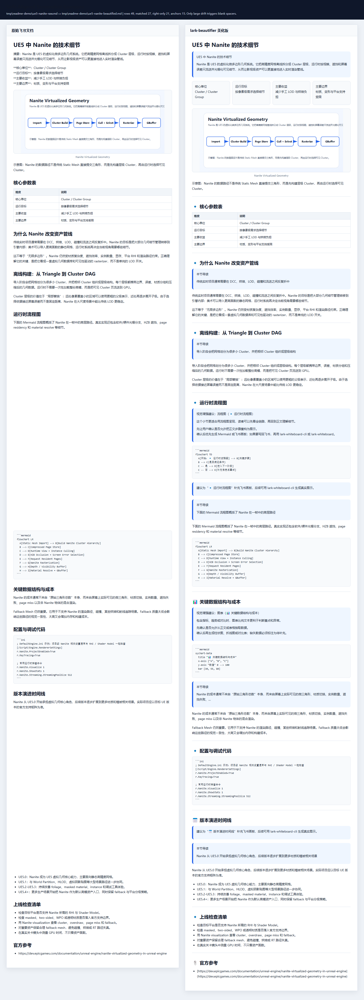
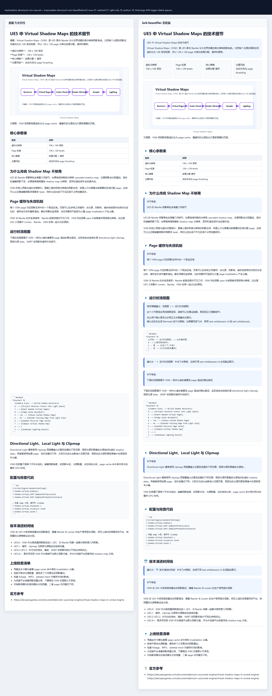
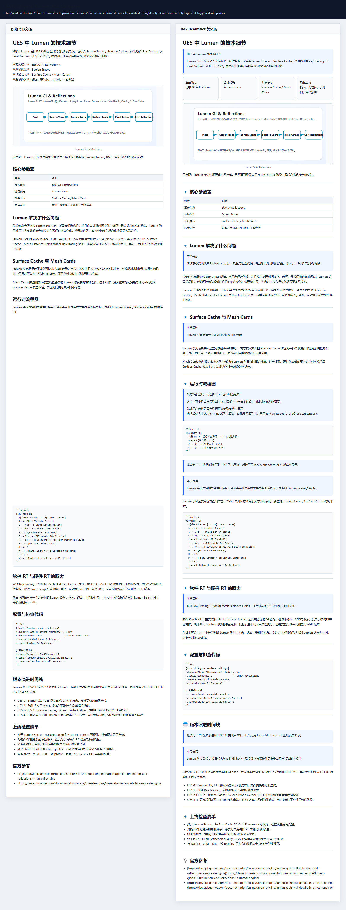

# Lark Beautifier

[中文说明](README.zh-CN.md)

Lark Beautifier is a Node.js / TypeScript CLI and installable agent skill for turning plain Markdown into Feishu/Lark-ready documents. It keeps the source meaning intact while adding safer structure, stronger visual rhythm, Lark-flavored Markdown components, and optional Feishu write-back helpers.

The current v3 direction is visual-first: the formatter still handles typography, callouts, grids, and smart tables, but the skill can also orchestrate cover blocks, section dividers, timelines, action items, Feishu whiteboards, flowcharts, diagrams, generated images, infographics, and Xiaohongshu-style demo cards when the user asks for a richer document.

## Before / After Examples

These examples use professional UE5 technical articles with text, tables, code/CVar snippets, Mermaid flowcharts, timelines, and image blocks. The article content was written against Epic's official UE5 documentation for Nanite, Virtual Shadow Maps, and Lumen, then passed through `lark-beautifier` and the aligned screenshot comparison skill.

### Nanite Technical Details



### Virtual Shadow Maps Technical Details



### Lumen Technical Details



## Features

- Cleans Chinese typography without touching fenced code, inline code, links, image URLs, raw HTML, or existing Lark XML blocks.
- Converts high-confidence cues into Feishu-style callouts and comparison grids.
- Renders complex Markdown tables as smarter Lark-friendly tables with semantic column widths.
- Separates risk mode from visual style: `safe | structured | bold` controls safety, while `theme` and `visualDensity` control presentation.
- Adds reusable components such as `cover-banner`, `section-divider`, `timeline`, `before-after`, `quote-block`, `kpi-card-row`, and `action-items`.
- Produces visual suggestions or drafts for whiteboards, Mermaid diagrams, image prompts, charts, and social cards.
- Includes a dry-run-first Feishu write-back helper for real docs through Feishu OpenAPI and `@larksuiteoapi/lark-mcp` OAuth.

## Install

```bash
npm install
npm run build
```

Run from source:

```bash
npm run dev -- examples/raw.md -o examples/beautified.md --mode structured
```

Run after build:

```bash
node dist/cli.js input.md --output output.md --mode structured
```

## Recommended User Workflow

1. Write or export the source document as Markdown. Keep code blocks, Mermaid diagrams, tables, timelines, and image references in the source when they matter.
2. Run `lark-beautifier` locally and write the result to `tmp/` or another review location.
3. Review the diff or output Markdown. Use `safe` for executive, legal, finance, and compliance-sensitive docs; use `structured` for normal team docs; use `bold` only for user-approved visual drafts.
4. Create a new Feishu document from the beautified Markdown, or run the write-back helper in dry-run mode against an existing document.
5. Apply to a live Feishu document only after the plan is reviewed. Use `--append` when you need to preserve existing content.

```bash
# 1. Generate a local beautified draft.
node dist/cli.js input.md \
  --output tmp/input-beautified.md \
  --mode structured \
  --theme auto \
  --components auto \
  --visual-density balanced

# 2. Inspect changes before writing anywhere.
node dist/cli.js input.md --mode structured --diff

# 3. Create a new Feishu document from the result.
lark-cli docs +create --as bot \
  --title "Beautified Document" \
  --markdown "@tmp/input-beautified.md"
```

If your Markdown references local images, Feishu cannot download those relative paths during `docs +create`. Insert local media after document creation:

```bash
lark-cli docs +media-insert --as bot \
  --doc "https://www.feishu.cn/docx/..." \
  --file doc/assets/readme/ue5-lumen-diagram.svg \
  --caption "Lumen rendering path"
```

## CLI Usage

```bash
node dist/cli.js input.md \
  --output output.md \
  --mode structured \
  --theme technical-blue \
  --visual-density rich \
  --components auto \
  --callouts auto \
  --grids auto \
  --tables smart \
  --whiteboards suggest \
  --enhancements suggest
```

Risk modes:

| Mode | Purpose |
| --- | --- |
| `safe` | Conservative formatting for high-stakes documents. |
| `structured` | Default mode for PRDs, meeting notes, technical plans, reports, retros, and project docs. |
| `bold` | Stronger visual draft mode for user-approved rich documents. |

Visual themes:

| Theme | Best For |
| --- | --- |
| `technical-blue` | Engineering docs, architecture notes, API docs, release notes. |
| `warm-product` | PRDs, product plans, user stories, launch docs. |
| `clean-minimal` | Executive briefs, external docs, compliance-sensitive writing. |
| `vivid-marketing` | Marketing drafts, social posts, event pages, demo scripts. |

Component controls:

```bash
# Let the analyzer choose high-confidence components.
node dist/cli.js input.md -o output.md --components auto --theme auto

# Opt into specific components only.
node dist/cli.js input.md -o output.md --components cover-banner,section-divider,action-items

# Inspect document signals as JSON.
node dist/cli.js input.md --analyze --check 2> analysis.json
```

Useful validation flags:

- `--check` exits non-zero if the file would change.
- `--diff` prints a unified diff.
- `--conservative` downgrades risky transformations.
- `--to-lark-cli` prints a legacy `lark-cli docs +create` command for the generated output file.

## Install As A Skill

The canonical skill package lives at:

```text
skills/lark-beautifier
```

Install it for Codex:

```bash
git clone https://github.com/wellingfeng/lark-beautifier.git
cp -R lark-beautifier/skills/lark-beautifier ~/.codex/skills/
```

Windows PowerShell:

```powershell
git clone https://github.com/wellingfeng/lark-beautifier.git
Copy-Item -Recurse lark-beautifier\skills\lark-beautifier $env:USERPROFILE\.codex\skills\
```

Then ask Codex to use `$lark-beautifier`.

## Agent Tutorial

When using the skill from Codex or Claude Code, give the agent the source, the target risk level, and whether it may create visual artifacts or write back to Feishu.

Safe local polish:

```text
Use $lark-beautifier to beautify docs/rendering-note.md for Feishu.
Use structured mode, write the output to tmp/rendering-note-beautified.md,
and do not update any live Feishu document yet.
```

Visual technical article:

```text
Use $lark-beautifier to turn this UE5 technical article into a rich Feishu
document. Keep the technical meaning intact. Use cover/KPI cards, native
tables, Mermaid flowcharts, a timeline, code blocks, and image placeholders.
Create a dry-run write-back plan only.
```

Live write-back with review:

```text
Use $lark-beautifier on this Feishu doc URL. First produce a dry-run plan
under tmp/. Show me the likely changes, table count, callout count, and
whether the default strategy would replace or append. Do not apply until I
confirm.
```

The Claude Code mirror is kept in lockstep at:

```text
.claude/skills/lark-beautifier
```

Project-local Claude Code install:

```bash
mkdir -p .claude/skills
cp -R lark-beautifier/.claude/skills/lark-beautifier .claude/skills/
```

## Feishu Write-Back

The write-back helper is dry-run-first. It can produce a plan from a local Markdown file without modifying the target document:

```bash
node skills/lark-beautifier/scripts/lark-doc-writeback.mjs \
  --doc "https://example.feishu.cn/docx/..." \
  --input examples/beautified.md \
  --mode structured \
  --plan-output tmp/writeback-plan.json
```

After reviewing the plan, apply it explicitly:

```bash
LARK_MCP_APP_ID=<app_id> node skills/lark-beautifier/scripts/lark-doc-writeback.mjs \
  --doc "https://example.feishu.cn/docx/..." \
  --input examples/beautified.md \
  --mode structured \
  --apply
```

For `--mode bold`, live write-back also requires `--confirm-bold`.

For first-time OAuth login, prefer the Lark MCP authorization-code flow:

```bash
npx -y @larksuiteoapi/lark-mcp login -a <app_id> -s <app_secret> -p 8765 --host 127.0.0.1
```

Do not commit app secrets, access tokens, refresh tokens, or local OAuth storage.

## Reproducing The README Comparisons

The README screenshots were generated with this pipeline:

1. Draft raw UE5 Markdown articles under `tmp/readme-demo/`.
2. Create raw Feishu documents with `lark-cli docs +create --as bot --markdown @tmp/readme-demo/<article>-raw.md`.
3. Beautify the Markdown with `lark-beautifier`.
4. Create beautified Feishu documents with `lark-cli docs +create --as bot --markdown @tmp/readme-demo/<article>-beautified.md`.
5. Generate paragraph-aligned long comparison images with `$aligned-screenshot-compare`.

Commands:

```bash
node tools/generate-readme-demo.mjs

node skills/lark-beautifier/scripts/beautify.mjs \
  tmp/readme-demo/ue5-nanite-raw.md \
  --output tmp/readme-demo/ue5-nanite-beautified.md \
  --mode bold \
  --theme technical-blue \
  --components auto \
  --visual-density rich \
  --enhancements draft

lark-cli docs +create --as bot \
  --title "UE5 Nanite Technical Details (Raw)" \
  --markdown "@tmp/readme-demo/ue5-nanite-raw.md"

lark-cli docs +create --as bot \
  --title "UE5 Nanite Technical Details (Beautified)" \
  --markdown "@tmp/readme-demo/ue5-nanite-beautified.md"

node skills/aligned-screenshot-compare/scripts/align-compare.mjs \
  --left tmp/readme-demo/ue5-nanite-raw.md \
  --right tmp/readme-demo/ue5-nanite-beautified.md \
  --left-title "Raw Feishu document" \
  --right-title "lark-beautifier output" \
  --out-html tmp/readme-demo/ue5-nanite-compare.html \
  --out-png doc/assets/readme/ue5-nanite-comparison.png
```

Repeat the same commands for `ue5-vsm` and `ue5-lumen`. Source references:

- Epic Games: [Nanite Virtualized Geometry in Unreal Engine](https://dev.epicgames.com/documentation/unreal-engine/nanite-virtualized-geometry-in-unreal-engine).
- Epic Games: [Virtual Shadow Maps in Unreal Engine](https://dev.epicgames.com/documentation/en-us/unreal-engine/virtual-shadow-maps-in-unreal-engine).
- Epic Games: [Lumen Global Illumination and Reflections](https://dev.epicgames.com/documentation/en-us/unreal-engine/lumen-global-illumination-and-reflections-in-unreal-engine) / [Lumen Technical Details](https://dev.epicgames.com/documentation/en-us/unreal-engine/lumen-technical-details-in-unreal-engine).

## Development

```bash
npm test
npm run check
npm run build
npm run lint:md
npm run check:skills
node skills/lark-beautifier/scripts/self-check.mjs
npm run package:skill
```

The canonical skill source is `skills/lark-beautifier`. After changing it, run:

```bash
npm run sync:skills
npm run check:skills
```
