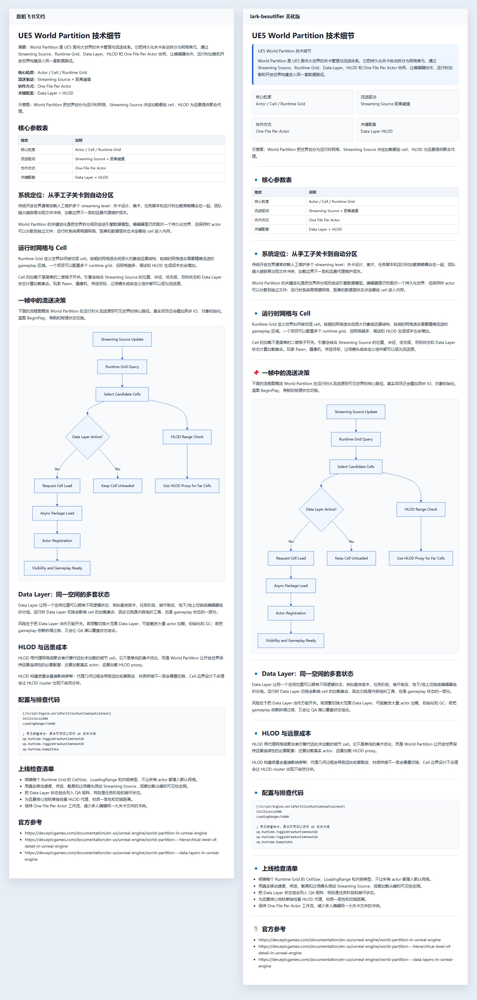
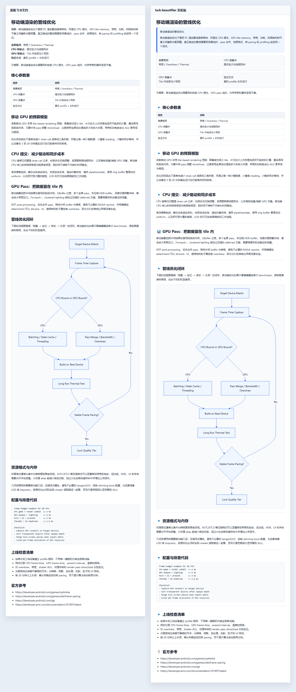
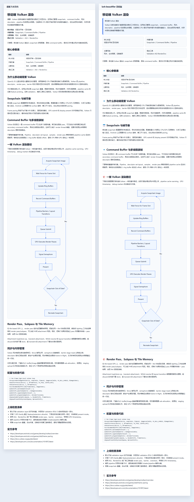

# Lark Beautifier

[English README](README.md)

Lark Beautifier 是一个 Node.js / TypeScript CLI，也是一套可安装的 Agent Skill，用来把普通 Markdown 转成适合飞书 / Lark 阅读和写回的文档。它不会重写事实和结论，而是在保留原文语义的前提下改善结构、节奏、飞书组件和视觉表达。

当前 v3 方向是“视觉优先”：工具仍然保留中文排版、callout、grid、智能表格等安全格式化能力，但 Skill 在用户要求“美化 / 强视觉版 / 图文并茂 / 新建视觉文档”时，会主动编排封面、章节分隔、时间线、行动项、飞书画板、流程图、架构图、配图、信息图和小红书演示卡片。

## 前后对比示例

下面三组示例是更接近真实技术文章的渲染引擎主题文档，内容包含正文、表格、代码片段、已渲染 Mermaid 流程图和上线检查清单。文章事实边界参考 Epic World Partition 文档、Android 游戏性能指南、Vulkan Guide 和 Arm 移动 GPU 最佳实践。

### UE5 World Partition 技术细节



### 移动端渲染的管线优化



### 移动端 Vulkan 渲染



## 能力

- 清理中文排版，不破坏代码块、行内代码、链接、图片 URL、HTML 和已有 Lark XML。
- 把高置信提示语转换为飞书风格 callout。
- 把对比型内容转换为 grid 分栏。
- 把复杂 Markdown 表格转换为更适合飞书的智能表格，并按列语义设置宽度。
- 把风险模式和视觉风格拆开：`safe | structured | bold` 控制安全边界，`theme` 和 `visualDensity` 控制视觉表达。
- 支持可复用组件：`cover-banner`、`section-divider`、`timeline`、`before-after`、`quote-block`、`kpi-card-row`、`action-items`。
- 可输出白板、Mermaid、图表、图片提示词、小红书卡片等视觉建议或草案。
- 内置 dry-run-first 的飞书 OpenAPI 写回脚本，优先使用 `@larksuiteoapi/lark-mcp` OAuth 授权码流程。

## 安装 CLI

```bash
npm install
npm run build
```

开发模式运行：

```bash
npm run dev -- examples/raw.md -o examples/beautified.md --mode structured
```

构建后运行：

```bash
node dist/cli.js input.md --output output.md --mode structured
```

## 推荐用户流程

1. 先准备 Markdown 源文档。技术文章可以保留代码块、Mermaid 图、表格、时间线和图片引用。
2. 本地运行 `lark-beautifier`，先把输出写到 `tmp/` 或其他可 review 的路径。
3. 检查 diff 或输出 Markdown。高管、法务、财务、合规文档用 `safe`；普通团队文档用 `structured`；只有用户明确确认强视觉草稿时才用 `bold`。
4. 用美化后的 Markdown 新建飞书文档，或对已有飞书文档先跑 dry-run 写回计划。
5. 只有确认计划后才写入真实文档。需要保留原内容时使用 `--append`。

```bash
# 1. 生成本地美化稿。
node dist/cli.js input.md \
  --output tmp/input-beautified.md \
  --mode structured \
  --theme auto \
  --components auto \
  --visual-density balanced

# 2. 写入前先查看变化。
node dist/cli.js input.md --mode structured --diff

# 3. 从美化稿新建飞书文档。
lark-cli docs +create --as bot \
  --title "Beautified Document" \
  --markdown "@tmp/input-beautified.md"
```

如果 Markdown 引用的是本地图片相对路径，飞书在 `docs +create` 时无法直接下载。创建文档后再插入本地媒体：

```bash
lark-cli docs +media-insert --as bot \
  --doc "https://www.feishu.cn/docx/..." \
  --file doc/assets/readme/mobile-vulkan-comparison.png \
  --caption "移动端 Vulkan 对比图"
```

## CLI 用法

```bash
node dist/cli.js input.md \
  --output output.md \
  --mode structured \
  --theme technical-blue \
  --visual-density balanced \
  --components auto \
  --callouts auto \
  --grids auto \
  --tables smart \
  --whiteboards suggest \
  --enhancements suggest
```

风险模式：

| 模式 | 适用场景 |
| --- | --- |
| `safe` | 高风险、高管、法务、财务类文档，只做保守排版和高置信结构化。 |
| `structured` | 默认模式，适合 PRD、会议纪要、技术方案、周报、复盘和项目文档。 |
| `bold` | 用户明确要求强视觉或测试文档时使用；草案级图表 / prompt 需要显式加 `--enhancements draft`。 |

视觉主题：

| 主题 | 适用场景 |
| --- | --- |
| `technical-blue` | 技术方案、架构文档、API 文档、发布说明。 |
| `warm-product` | PRD、产品规划、用户故事、上线方案。 |
| `clean-minimal` | 高管简报、外部文档、合规敏感内容。 |
| `vivid-marketing` | 营销稿、活动页、社媒内容、演示脚本。 |

组件控制：

```bash
# 让 analyzer 自动选择高置信组件。
node dist/cli.js input.md -o output.md --components auto --theme auto

# 只启用指定组件。
node dist/cli.js input.md -o output.md --components cover-banner,section-divider,action-items

# 输出文档分析信号 JSON。
node dist/cli.js input.md --analyze --check 2> analysis.json
```

常用校验参数：

- `--check`：如果文件会被修改则返回非零退出码。
- `--diff`：打印 unified diff。
- `--conservative`：降低有风险的自动转换。
- `--to-lark-cli`：输出旧版 `lark-cli docs +create` 命令，便于把结果创建为飞书文档。

## 安装为 Skill

Codex Skill 的 canonical 源目录是：

```text
skills/lark-beautifier
```

安装到 Codex：

```bash
git clone https://github.com/wellingfeng/lark-beautifier.git
cp -R lark-beautifier/skills/lark-beautifier ~/.codex/skills/
```

Windows PowerShell：

```powershell
git clone https://github.com/wellingfeng/lark-beautifier.git
Copy-Item -Recurse lark-beautifier\skills\lark-beautifier $env:USERPROFILE\.codex\skills\
```

之后让 Codex 使用 `$lark-beautifier` 即可。

## 给 AI Agent 用的教程

使用 Codex 或 Claude Code 时，把输入、风险等级、是否允许生成视觉资产、是否允许写回飞书说清楚。

安全本地美化：

```text
Use $lark-beautifier to beautify docs/rendering-note.md for Feishu.
Use structured mode, write the output to tmp/rendering-note-beautified.md,
and do not update any live Feishu document yet.
```

强视觉技术文章：

```text
Use $lark-beautifier to turn this UE5 technical article into a rich Feishu
document. Keep the technical meaning intact. Use cover/KPI cards, native
tables, Mermaid flowcharts, a timeline, code blocks, and image placeholders.
Create a dry-run write-back plan only.
```

带 review 的真实写回：

```text
Use $lark-beautifier on this Feishu doc URL. First produce a dry-run plan
under tmp/. Show me the likely changes, table count, callout count, and
whether the default strategy would replace or append. Do not apply until I
confirm.
```

Claude Code 镜像目录保持同步在：

```text
.claude/skills/lark-beautifier
```

项目级 Claude Code 安装：

```bash
mkdir -p .claude/skills
cp -R lark-beautifier/.claude/skills/lark-beautifier .claude/skills/
```

## 飞书写回

写回脚本默认 dry-run，只生成计划，不修改真实文档：

```bash
node skills/lark-beautifier/scripts/lark-doc-writeback.mjs \
  --doc "https://example.feishu.cn/docx/..." \
  --input examples/beautified.md \
  --mode structured \
  --plan-output tmp/writeback-plan.json
```

确认计划后，再显式加 `--apply` 写回：

```bash
LARK_MCP_APP_ID=<app_id> node skills/lark-beautifier/scripts/lark-doc-writeback.mjs \
  --doc "https://example.feishu.cn/docx/..." \
  --input examples/beautified.md \
  --mode structured \
  --apply
```

如果使用 `--mode bold`，真实写回前还需要用户确认并额外传入 `--confirm-bold`。

首次登录优先使用 Lark MCP OAuth 授权码流程：

```bash
npx -y @larksuiteoapi/lark-mcp login -a <app_id> -s <app_secret> -p 8765 --host 127.0.0.1
```

不要提交 app secret、access token、refresh token 或本地 OAuth 存储文件。

## 复现 README 对比图

README 中的三张长图按下面流程生成：

1. 在 `tmp/readme-demo/` 下生成渲染引擎技术文章原始 Markdown。
2. 用 `lark-cli docs +create --as bot --markdown @tmp/readme-demo/<article>-raw.md` 创建原始飞书文档。
3. 用 `lark-beautifier` 美化 Markdown。
4. 用 `lark-cli docs +create --as bot --markdown @tmp/readme-demo/<article>-beautified.md` 创建美化版飞书文档。
5. 用 `$aligned-screenshot-compare` 生成段落对齐长图。

命令示例：

```bash
node tools/generate-readme-demo.mjs

node skills/lark-beautifier/scripts/beautify.mjs \
  tmp/readme-demo/ue5-world-partition-raw.md \
  --output tmp/readme-demo/ue5-world-partition-beautified.md \
  --mode structured \
  --theme technical-blue \
  --components auto \
  --visual-density balanced \
  --whiteboards off \
  --enhancements off

lark-cli docs +create --as bot \
  --title "UE5 World Partition 技术细节（原始版）" \
  --markdown "@tmp/readme-demo/ue5-world-partition-raw.md"

lark-cli docs +create --as bot \
  --title "UE5 World Partition 技术细节（lark-beautifier 美化版）" \
  --markdown "@tmp/readme-demo/ue5-world-partition-beautified.md"

node skills/aligned-screenshot-compare/scripts/align-compare.mjs \
  --left tmp/readme-demo/ue5-world-partition-raw.md \
  --right tmp/readme-demo/ue5-world-partition-beautified.md \
  --left-title "原始飞书文档" \
  --right-title "lark-beautifier 美化版" \
  --out-html tmp/readme-demo/ue5-world-partition-compare.html \
  --out-png doc/assets/readme/mobile-world-partition-comparison.png \
  --presentation
```

把 `ue5-world-partition` 替换为 `mobile-render-pipeline`、`mobile-vulkan` 即可复现另外两张。官方参考：

- Epic Games：[World Partition in Unreal Engine](https://dev.epicgames.com/documentation/en-us/unreal-engine/world-partition-in-unreal-engine)、[World Partition HLOD](https://dev.epicgames.com/documentation/en-us/unreal-engine/world-partition---hierarchical-level-of-detail-in-unreal-engine)、[World Partition Data Layers](https://dev.epicgames.com/documentation/en-us/unreal-engine/world-partition---data-layers-in-unreal-engine)。
- Android Developers：[Optimize your game](https://developer.android.com/games/optimize)、[Android Frame Pacing](https://developer.android.com/games/sdk/frame-pacing)、[Android GPU Inspector](https://developer.android.com/agi)。
- Khronos Group：[Vulkan Guide](https://docs.vulkan.org/guide/latest/)。
- Arm：[Mali GPU Best Practices](https://developer.arm.com/documentation/101897/latest)。

## 开发与校验

```bash
npm test
npm run check
npm run build
npm run lint:md
npm run check:skills
node skills/lark-beautifier/scripts/self-check.mjs
npm run package:skill
```

Skill 的 canonical 源头是 `skills/lark-beautifier`。修改后同步到 `.claude`：

```bash
npm run sync:skills
npm run check:skills
```
